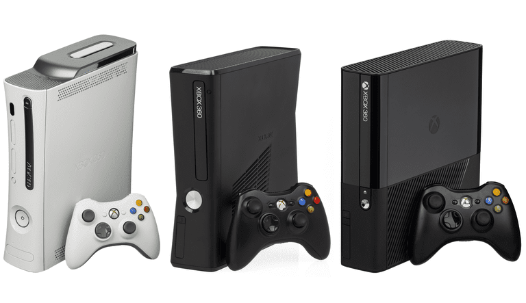

# 360 Hack Pack - The Ultimate Xbox 360 Starter Pack

_By Alex Free_.

Everything you need to hack any Xbox 360, ready to be copied onto a USB drive in one download! 

This all in one package currently includes:

Exploit:

* [ABadAvatar](https://github.com/shutterbug2000/ABadAvatar/) v1.0. (Based on [Grimdoomer](https://github.com/grimdoomer)'s [BadUpdate](https://github.com/grimdoomer/Xbox360BadUpdate).

Soft-mod loaders: (you decide):

* [FreeMyXe](https://github.com/FreeMyXe/FreeMyXe) v1.1.
* [XeUnshackle](https://github.com/Byrom90/XeUnshackle) v1.0.3 Beta.

Homebrew pograms:

* [XexMenu Live](https://digiex.net/threads/xexmenu-1-1-download-xex-menu-iso-live-and-xex-file-manager-for-xbox-360.11096/) v1.1.

* [Aurora](http://phoenix.xboxunity.net/#/news) v0.7b2.

* [Simple 360 Nand Flasher](https://github.com/Swizzy/XDK_Projects) v1.5b Read Only (Special BadUpdate Edition).

* [Dashboard / System Update](https://digiex.net/threads/xbox-360-dashboard-system-update-2-0-17559-0-download-with-avatars.16047/) v2.0.17559.0.

* [HDD Compat Partition Fixer (for original Xbox backwards compatibility)](https://consolemods.org/wiki/File:Hdd_compat_partition_fixer_v1.zip) v1.

* [Hacked Compatibility Files (for original Xbox backwards compatibility)](https://consolemods.org/wiki/Xbox_360:Original_Xbox_Games) v12-09-2019.

* [Xell-Reloaded](https://github.com/Free60Project/xell-reloaded) v0.993. 2 different builds, one for Winchesters (`apps\xell-reloaded-v0.993-d4f08b4-winchester\default.xex`) and one for all other consoles (`apps\xell-reloaded-v0.993\default.xex`). These both use Xell Launch so they can be started by `default.xex` in their folder from i.e. Aurora file manager or XexMenu.

| [Homepage](https://alex-free.github.io/360-hack-pack) | [Github](https://github.com/alex-free/360-hack-pack) | [GBATemp Thread](https://gbatemp.net/threads/xbox-360-hack-pack-everything-you-need-in-one-download.668769/) | [PSX-Scene Thread](https://www.psx-place.com/threads/xbox-360-hack-pack-everything-you-need-in-one-download.47216/#post-410883) |

## Table Of Contents

* [Downloads](#downloads)
* [Usage](#usage)
* [Additional Info](#additional-info)
* [License](license.md)
* [Credits](#credits)
* [Building](build.md)

## Downloads

### Version 1.0.5 (4/29/2026)

Changes:

* Replaced [BadUpdate](https://github.com/grimdoomer/Xbox360BadUpdate) with [ABadAvatar](https://github.com/shutterbug2000/ABadAvatar). Thanks [@Lost-Entrepreneur439](https://github.com/Lost-Entrepreneur439) for finally pushing me to add it.

* Removed Rock Band Blitz demo since this is no longer needed. Just turn on the console and wait at the sign-in screen on boot doing nothing until the exploit triggers. This will also massively save space on the 'ready to copy' releases of 360 hack pack. Literally easist exploit every completely automatic at this point.

* Changed download links from digiex to archive.org equievelents, since they are faster and more reliable.

* Small fixes to 360hp and build system.

---------------------------------------

* [360-hack-pack-v1.0.5-freemyxe-ready-to-copy.zip](https://github.com/alex-free/360-hack-pack/releases/download/v1.0.5/360-hack-pack-v1.0.5-freemyxe-ready-to-copy.zip) _Complete file set for FreeMyXe_

* [360-hack-pack-v1.0.5-xeunshackle-ready-to-copy.zip](https://github.com/alex-free/360-hack-pack/releases/download/v1.0.5/360-hack-pack-v1.0.5-xeunshackle-ready-to-copy.zip) _Complete file set for XeUnshackle_

* [360-hack-pack-v1.0.5-downloader.zip](https://github.com/alex-free/360-hack-pack/releases/download/v1.0.5/360-hack-pack-v1.0.5-downloader.zip) _Downloader for Linux/Mac OS_

---------------------------------------

[Previous versions](changelog.md).

## Usage

There are 2 different releases. 'Ready To Copy' is the complete starter pack in full. 'Downloader' downloads all the files from the internet to your USB drive and is much smaller.

1) Create a new offline profile on your Xbox 360 that will not use Xbox live. Turn off auto-sign in.

2) Disconnect from the internet on your Xbox 360. If you have a wired ethernet connection, physically unplug the cord. If you have a WiFi connection, forget your WiFi network.

3) Disable auto-power off on your Xbox 360.

4) Format your USB drive using your Xbox 360.

5) Eject your USB drive from your Xbox 360.

6) Connect your USB drive to your computer.

7) Extract the latest 360 Hack Pack release.

8) If you are using the 'Ready To Copy' release, open the `files` directory in the extracted 360 Hack Pack release. Copy everything inside of `files` onto the root of your USB drive. Note: on Mac, the Finder does not allow a simple copy and paste because of the hidden `Content` folder. To work around this you can use the `360hp` command included in the 'Ready To Copy' release. The `360hp` command needs the path to your USB drive, i.e. `360hp /Volumes/NO\ NAME`. If you are using the 'Downloader' release, the command is similar. Do `360hp -x /Volumes/NO\ NAME` for XeUnshackle, or `360hp -f /Volumes/NO\ NAME` for FreeMyXe.

9) Eject your USB drive from your computer.

10) **Turn off your Xbox 360, and then plug in your USB drive**. Power it on. If you are prompted to update the dashboard, do so. You should already disconnected from the internet so this will only show if you need to update your dash for BadUpdate, and it will pull the update from the USB drive. **DO NOT UPDATE VIA THE INTERNET IN CASE A NEW DASHBOARD UPDATE THAT PATCHES BADUPDATE COMES OUT!**

11) Wait at the sign in screen for a minute or two and the exploit will trigger.

## Additional Info

* BadUpdate is not a 100% reliable exploit (although the chance of success has been improved tremondously since Bad Update v1.2 came out, now in 360 Hack Pack v1.0.3+). If nothing happens for a few minutes while sitting on the sign-in screen, turn the console on and off and try again. You may or may not need to do this many times until it works as success is completely random but quite reliable at this point. Sometimes it starts immedietly, sometimes it takes minutes so it may just be worth restarting to try to hit that near instant exploit chance.

* Once BadUpdate brings you back to the dash board, you can connect to the internet because Xbox Live is blocked. Before turning off the console, you should disconnect from the internet however. If you have a wired ethernet connection, physically unplug the cord. If you have a WiFi connection, forget your WiFi network. If you have a power loss in your home and were not able to do this, as long as you turned off auto-sign in to an Xbox live profile and or turned on auto-sign in for an offline profile you should be ok. You can also skip signing in until your exploited again (recommended).

* JTAG/RGH consoles are capable of modifying NAND. **BadUpdate consoles can not modify NAND without bricking!** Some homebrew programs do allow you to modify the NAND for some features, because it was never a problem before BadUpdate came out. For this reason I have for example built Simple 360 NAND Flasher with the new Read Only target, which disables all NAND flashing functionality but still allows you to dump and backup your NAND. You should backup your NAND immediately after first exploiting your console with the included Simple 360 NAND flasher read-only build. Even though you can't write the NAND backup with a BadUpdate console, if you brick it by accidentally writing to the NAND with some other home brew you could JTAG/RGH it and use said NAND backup to fix it (or have someone else do that for you if you supply said NAND backup).

* Updating to a new version of the hack pack is easy. You can safely overwrite an existing USB drive like it was a clean install (no existing files are deleted by design). You may get duplicate versions of older applications in your `apps` folder, you can delete the oldest one safely.

* You may also switch between FreeMyXe and XeUnshackle at any time (although your USB drive may get a bit cluttered as again, nothing is ever deleted just overwritten/added).

* You can remove your USB drive after the exploit has run from your console if your in the stock NXE original Xbox 360 dashboard without any issue (that way nothing is running off USB). The Aurora plugin will stop working if you do so (the thing that tells you the CPU temps and allows you to launch Aurora dash board after pressing the home button on the Xbox 360 controller) since it was loaded from USB, but Aurora itself can be launched again once the USB drive is inserted back into the console. You could also move everything to the HDD to prevent this.
 
## OG Xbox Compat

To setup original Xbox backwards compatibility:

1) If you do not have an official Micro$oft HDD, run `\apps\hdd-compat-partition-fixer-v1\default.xex` on your USB drive to setup the `HDDx` partition.

2) Copy the `HDDx\Compatibility` folder to your USB flash drive (to backup the original files).

3) Copy the `\apps\hacked-bc-files-12-09-2019\64MB\Regular\Compatibility` from your flash drive to your `HDDx` partition. This will overwrite your existing `HDDx\Compatibility` folder.

If your using FreeMyXe, you need to run `apps\OGXboxPrep.xex` on your USB flash drive before you start an original Xbox game. After you exit the original Xbox game, you need to run `apps\OGXboxPrep.xex` again before running Xbox 360 software. **This isn't required with XeUnshackle.**

 ## TODO

* Patch Aurora.xex/make it boot automatically after FreeMyXe. This already works for XeUnShackle, but I need to integrate actually patching of the Aurora before making the zip file for FreeMyXe to auto-launch after exploit.

* More options for original Xbox compatibility included by default.

* ?? You tell me. I've been very happy with this. All my games from Fallout 3+GOTY DLC to GTA V have worked since pretty much the begining. 

 ## Credits

* [@Grimdoomer](https://github.com/grimdoomer) for [BadUpdate](https://github.com/grimdoomer/Xbox360BadUpdate).

* [@shutterbug2000] for [ABadAvatar](https://github.com/shutterbug2000/ABadAvatar/)]

* [InvoxiPlayGames](https://github.com/InvoxiPlayGames) for FreeMyXe.

* [Byrom90](https://github.com/Byrom90) for XeUnshackle.

* [Swizzy](https://github.com/Swizzy) for Simple 360 Nand Flasher.

* Any and all other developers of the included homebrew I did not explicitly credit yet (TODO).