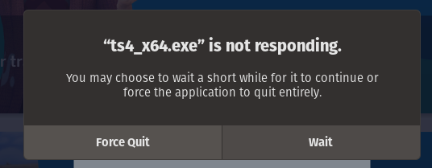
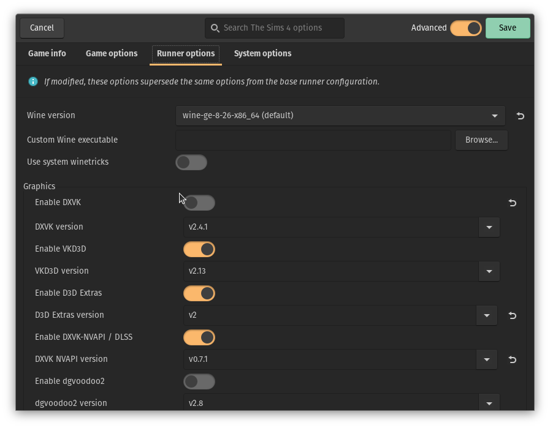

# Fixing The Sims 4 FitGirl Repack On Lutris

Alex Free - 11/8/2024

## Why

The Sims 4 was re-released by EA on 10/18/2022 as [free to play](https://help.ea.com/en/help/the-sims/the-sims-4/sims-4-free-to-play/). So why use the FitGirl Repack? **No DRM**. I love that I can play games on a free and open source OS with no DRM at great performance with my gaming laptop. Even if the FitGirl repack didn't have the DLC, I'd still use it over the actual official game builds. 

## The Problem
 
 

Currently, I'm on Pop OS! 22.04 using an Nvidia graphics card. I'm using [lutris](https://lutris.net/) to play games with Wine. The best Wine runner available is a bit outdated (`wine-ge-8-26-x86_64`) since wine-ge developemnt is moving on to [UMU Launcher](https://github.com/Open-Wine-Components/umu-launcher). I am behind the times and still using Lutris though.

So the problem is, that The Sims 4 starts up fine and works for a while, but eventually the graphics can get slow and always without fail it will freeze forever and say `TS4_x64.exe is not responding` until you `Force Quit` it. I found [this reddit post](https://web.archive.org/web/20220606181931/https://www.reddit.com/r/Piracy/comments/hwc6hf/sims4_fitgirl_repack_64_bit_version_on_linux/) that mentions issues with The Sims 4 due to updates in DXVK. I tried changing the DXVK version in Lutris and it didn't fix this issue. But it certainly put me on the right track!

## The Fix

Disable DXVK. Sucks for performance, but finally at long last this thing is rock solid. I have a ton of GPU performance to throw away with a GTX 3050ti mobile GPU so I can do this and still have a playable game on all high settings.