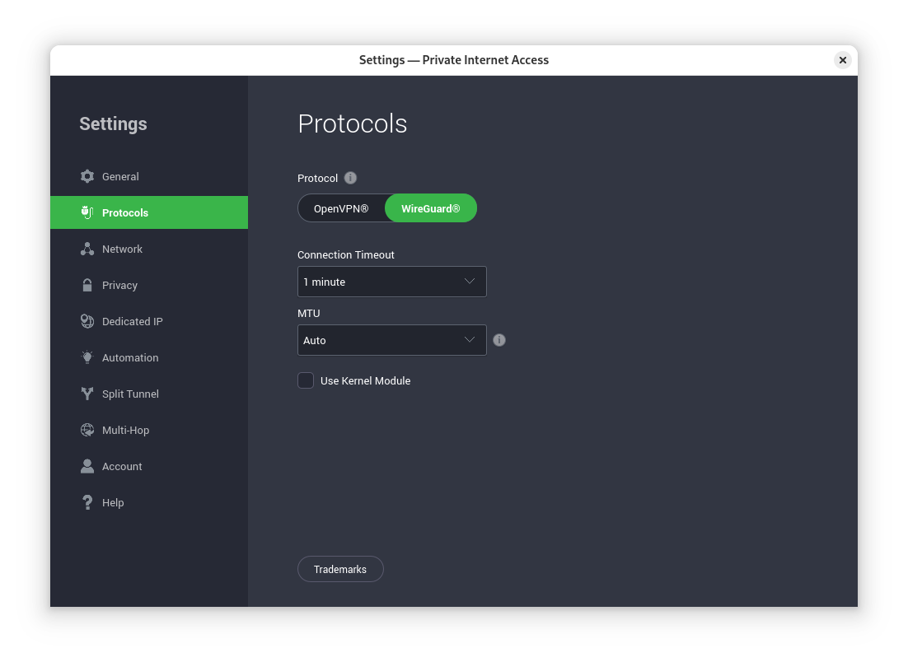

# PIA VPN Linux Crash Fix

_By Alex Free_

_2/25/2025_

So I use Fedora Linux 41 with Private Internet Access VPN. Lately I've encountered an extremely annoying issue, where the VPN would take down the entire system. Complete unrecoverable crash of the whole system. No SSH access. Happens about 5 minutes after the system starts up. Other things I noticed where that sometimes it would crash if you turned off the WiFi, or sometimes it would take down the whole network interface. Ugh...

This happened when I switched from Mullvad to PIA (simply because Mullvad hates my stupid bank no one likes for online payments). So I wondered, how could a VPN app take down an entire Linux box?

Well, there is this thing called a 'kernel module' that PIA uses by default. I disabled that and also selected to only use Wiregaurd. Rebooted the whole system, and haven't had an issue since!

