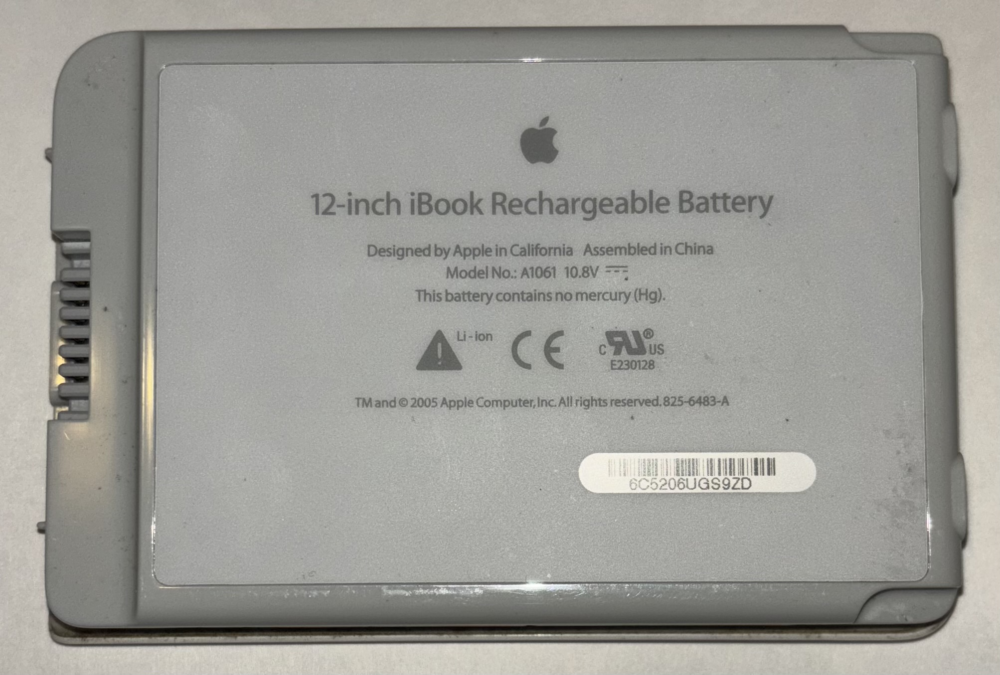
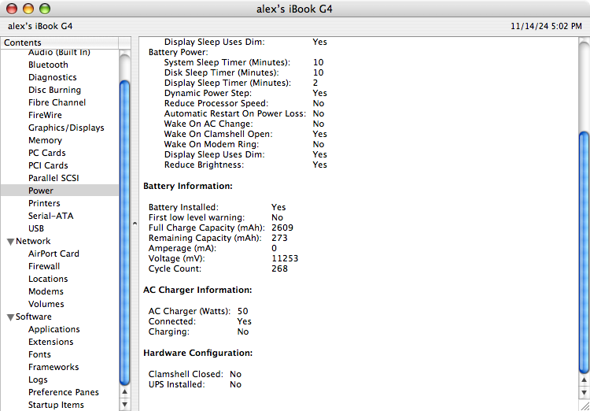
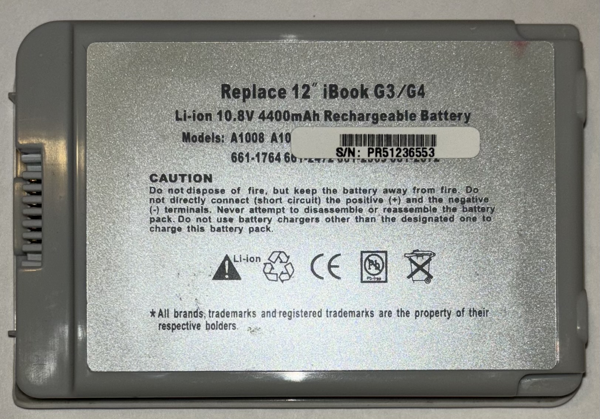
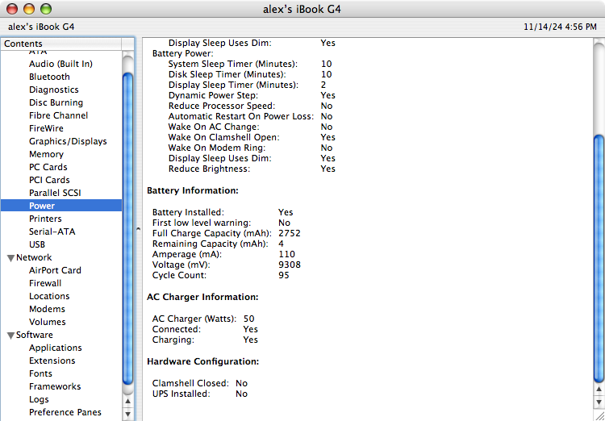

# You Should Remove Your iBook G4 Battery

_By Alex Free - 11/7/2024._

_Updated on 11/14/2024._

This blog post is also available as a [MacRumors forum post](https://forums.macrumors.com/threads/you-should-remove-your-ibook-g4-battery.2442944/?post=3356615).

## Why I Like The iBook G4

I have 2 [12 inch iBook G4 mid 2005s (PowerBook 6,7)](https://everymac.com/systems/apple/ibook/specs/ibook_g4_1.33_12.html). One has a defective `~` keyboard key and has been relegated to a source for spare parts. These are the absolute cheapest way to get into the PowerPC Mac world. They have a great GPU with OpenGL 2 support (a PowerPC rarity that you need Leopard to take advantage of), a 4:3 screen, fast 1.33GHz PowerPC G4, and potential for up to 1.5GBs of RAM. It's basically a mobile Mac mini. Things I don't like about it is the soldered in 512MBs of RAM that can't be replaced, the difficulty of replacing the HDD in comparison to the early intel MacBooks, and the lack of Mac OS X Panther support.

## Power Problems

Anyways, I was using the iBook G4 and noticed some unexpected shutdowns, that have gotten progressively worse. It _appeared_ that the charger would loose a good connection and the unit would power off because the battery was useless. This got progressively worse until it wouldn't last more then a few minutes after login. Was the single 3rd party iBook charger I have on it's death bed?

I tried using the same charger on the other iBook G4, and something weirder occurred. The iBook would constantly complain it needed to connect to AC power and show no power source for a matter of a few seconds total, but then it would appear connected. In an endless loop. So the charger is a dud, right?

## Fixing It With A Quarter

I'll give you a hint, it's not the charger or the iBook. It is... the battery! Both batteries are long past being useful, and while I never intended them to be used as a power source for the iBook G4s they will still part of the power logic of the iBook. And low and behold when I checked about this mac in Mac OS X, the battery in the one doing the infinite connect to ac power message loop had 0 amperage! That battery was actually an original Apple battery, which interestingly has a [serial number](hhttps://web.archive.org/web/20080219031810/https://support.apple.com/ibook_powerbook/batteryexchange/main?id=qp) not affected iBook G4 battery recall. I am unsure if this is because the battery never used the problematic Sony Cells, or if this is in fact a replacement given to the original owner who was affected.

Here is the problematic Apple battery, that made Mac OS X constantly complain that the battery not connected every few seconds:

The other battery that was causing random shutdowns was the 3rd party battery:

The iBook G4 is lucky to not have the same [limitations](https://web.archive.org/web/20080226124639/http://docs.info.apple.com/article.html?artnum=305336) of the early intel MacBooks in regards to operating without a battery installed. When an early intel MacBook lacks a battery, it is [throttled to 50%](https://forums.macrumors.com/threads/cpu-throttling-with-battery-removed.504595/). When the iBook G4 lacks a battery, it works perfectly fine!

So I shutdown the iBook G4, removed the battery with a quarter, and powered it back up. No power fluctuations! Maybe it is actually running with better performance now as well since it stays on the `Better Performance` option constantly without the battery switching it over to a different `Energy Saver` setting. Another pro, your iBook G4 won't blow up one day (batteries get incredibly unstable after 20 years)!

## Conclusion

If your having this problem It might not be your charger, which is what everything pointed to at first. I think the problem here is that both of these batteries can't handle the power draw even while 'charing' since they are so degraded.

The lack of 3rd party battery options for the iBook G4 is unfortunate. That would also fix this issue, however at least we can run at full performance without throttling when no battery is installed. The early Intel MacBooks still have 3rd party batteries made for them to this day though so it's not quite a problem for them yet.

## Going Further

There are ways to [rebuild](http://www.neufeld.newton.ks.us/electronics/?p=149) the battery by replacing the power cells, but it's not for the faint of heart and I haven't dared to attempt it.

I'm also interested in if I can just remove all of the components in the battery and have an empty shell that can be put back into the iBook G4.

