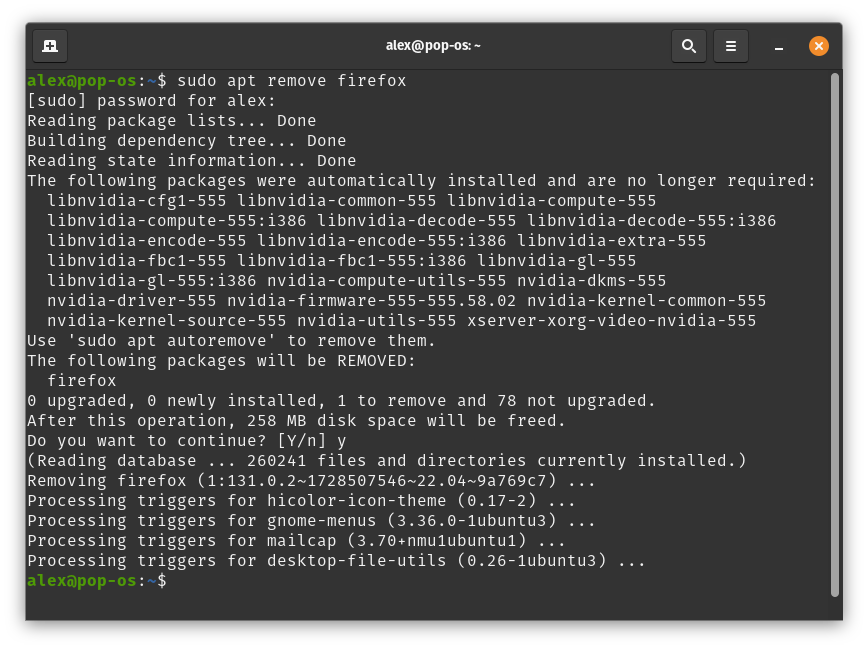

# You Should Switch To Ungoogled Chromium
Alex Free - 11/6/2024

## Rise

I remember when FireFox was in it's stride. Going from Internet Explorer to Firefox was such a huge upgrade. Microsoft had gotten too arrogant with Internet Explorer. With no real competition, development had not really pushed the web forward in any positive way. Firefox offered:

* Open Source.

* Fast and compatible with many quirks of the time.

* More focused developer resources on user facing features and improvements.

* Cross platform.

* More secure, better reputation.

## Fall

* Chrome was promoted nonstop via Google search.

* Chromium (Chrome is a proprietary derivate of the open source Chromium code) has a better open source license (my favorite, [3-BSD](https://github.com/chromium/chromium/blob/main/LICENSE)). You get more user freedom then with FireFox's GPL-like [MPL](https://www.mozilla.org/media/MPL/2.0/index.f75d2927d3c1.txt).

* Chromium was actually portable, well written code. Other browsers could use it's code as a base (i.e. [Brave](https://brave.com/)). Things like [Electron](https://www.electronjs.org/) power [Visual Studio code](https://code.visualstudio.com/) could use it for things that are not even a web browser. FireFox's code is so insane that there has been little interest has been in these areas for it.

* Chrome has [arguably better dev tools](https://forum.freecodecamp.org/t/which-browser-has-the-best-developer-tools-and-explain-why/2025/7) in comparison to FireFox, which caused web devs to use it over FireFox.  Some web devs stopped testing on FireFox entirely since they themselves didn't use it. Many websites recommend only using chrome.

* Firefox development became increasingly cooperate, political, and unfocused. They are now [an AD company](https://www.mozilla.org/en-US/advertising/) promoting "privacy preserving ADs to save the internet". No thanks!

* Mozilla seems more interested in [revenue generating things](https://www.mozilla.org/en-US/products/) like VPNs, sponsored ADs directly on your home page, telemetry, and Google's search engine default integration which funds them to do all of this garbage.

* Mozilla seems less interested in developing a better browser. There are [bugs older then me](https://arstechnica.com/gadgets/2023/10/22-year-old-firefox-tooltip-bug-fixed-in-a-few-lines-offering-hope-to-us-all/) open in the issue tracker. The browser is just slower then Chrome, less compatible, more bloated. Worse UI.

## What Now?

[Ungoogled Chromium](https://github.com/ungoogled-software/ungoogled-chromium). This project fixes the chromium source with changes such as:

* Removes a bunch of telemetry and other bad Google stuff from really great browser code.

* Not influenced by a corporation or politics. Just open source.

* Really good defaults. On file downloads you are prompted for where to download it (inspires you to do great file management and organization). The garbage chrome antivirus thing in Chrome is disabled. Antivirus is ruining bedroom coder's ability to release software to users and I hate all of it. Chrome won't even let you download some of my software with it's whitelist anti-virus.
