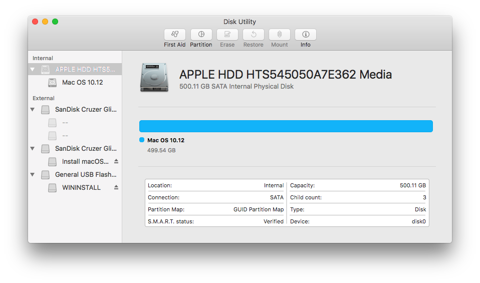
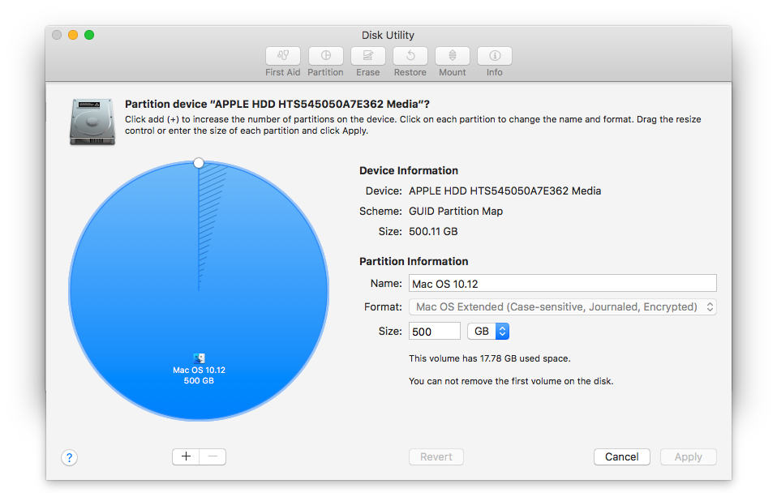
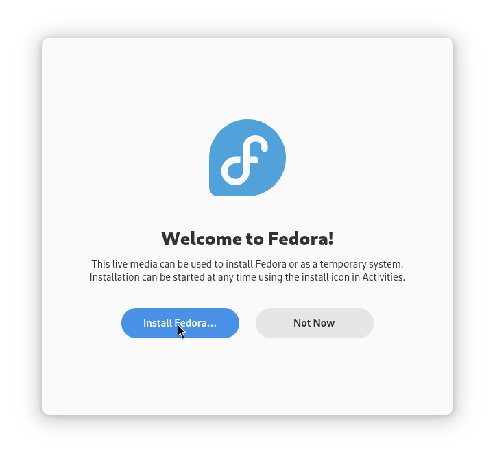

## Mac Mini Late 2012 Triple Boot

_By Alex Free_

v1.0 - 1/17/2025

This guide will describe how I triple boot a [late 2012 Mac mini](https://everymac.com/systems/apple/mac_mini/specs/mac-mini-core-i5-2.5-late-2012-specs.html) with Mac OS (any version that can run), Windows 7, and Fedora Linux. 

Specifically, I will be setting up a triple boot of Mac OS 10.12, Fedora Linux 41, and Windows 7 Pro (64-bit). There will also be a `Shared` `ExFat` partition, useful for file transfers between all 3 OSes. ExFat has no 4GB file size limitation, nor does it have a partition size limit of 32GB like regular FAT32.

## Table Of Contents

* [Requirements](#requirements)
* [Step 1: Install Mac OS](#step-1-install-mac-os)
* [Step 2: Create Partitions](#step-2-create-partitions)
* [Step 3: Setup Manufacturing Picker](#step-3-setup-manufacturing-picker)
* [Step 4: Install Linux](#step-4-install-linux)
* [Step 5: Set Up A Hybrid MBR](#step-5-set-up-a-hybrid-mbr)
* [Step 6: Install Windows 7](#step-6-install-windows-7)

## Requirements:

* A USB flash drive with the Windows installer on it. Boot Camp assistant can create this for you on Mac OS if you have a Windows 7 `.iso` file.

* A USB flash drive with the Mac OS installer on it (if you don't have Mac OS currently installed and are starting from scratch).

* A USB flash drive with the Fedora Linux installer on it.

* Wired Ethernet, WIFI to Ethernet adapter, or USB WiFi adapter (Fedora Linux doesn't have WiFi firmware installed by default).

If you already have Mac OS installed, skip to [Step 2: Creating Partitions](#step-2-creating-partitions). 

If you currently have a dual boot setup use Disk Utility in Mac OS to remove all partitions besides the Mac OS one (it will automatically be resized to take up your whole internal disk). You must have only one partition visible in Disk Utility before continuing to [Step 2: Creating Partitions](#step-2-creating-partitions).

If you are starting from scratch with no OS installed, you'll also need a a wired USB keyboard. Keep in mind that **a wireless keyboard using a USB dongle or bluetooth keyboard will not work to bring up the Mac boot menu on startup**.

## Step 1: Install Mac OS

First, ensure the Mac is turned off. **Plug in the wired USB keyboard to the USB port closest to the HDMI cable**. It must be in that port to bring up the boot menu. Plug in the USB drive containing the Mac OS installer. Press and hold the option key (Apple keyboard) or the left alt key (PC keyboard) down and then press the power button. Keep holding the option or alt key until the boot menu appears, and then select the Mac OS installer USB drive.

After booting into the Mac OS installer, open Disk Utility. Click the HDD or SSD under the `Internal` section at the left of the Disk Utility window. Click `Erase`. In the drop down, name your partition for Mac OS. I named it `Mac OS 10.12`. I changed the format from the default for Mac OS 10.12 (`Mac OS Extended (Journaled)`) to `Mac OS Extended (Case -sensitive, Journaled, Encrypted)` but this is not required and just my preference. Note that `APFS` is the default of Mac OS 10.13 and up. Keep the `Scheme` as `GUID Partition Map` and click `Erase`. Once that completes, click the red X to close the Disk Utility window and then click `Install macOS`. Click `Continue`, `Agree`, `Agree` (again), Select your newly created partition, and wait.

Once installation completes, finish setting up Mac OS and then boot into it.

## Step 2: Create Partitions

Open Disk Utility. Select the Internal drive on the left of the Disk Utility Window. Click `Parition`. Create 3 additional partitions with the filesystem defaults in this extremely important order:

1) Linux.
2) Windows.
3) Shared. 

Disk Utility in older Mac OS X versions use a top down view (the `Shared` partition must be at the bottom). Disk Utility in newer Mac OS versions use a clockwise wheel (the `Shared` partition must be most clockwise and end at 12 'o clock).

Once the partitions are created, click the `Windows` partition in the the left side of the Disk Utility window and then click `Erase` at the top of the window. Select `ExFat` as the format and erase it as `Windows`.

Do the same for the `Shared` partition. Click the `Shared` partition in the the left side of the Disk Utility window and then click `Erase` at the top of the window. Select `ExFat` as the format and erase it as `Shared`.

Copy the Boot Camp drivers to the `Shared` partition for use later in Windows. They can be downloaded [here](https://support.apple.com/en-us/106404).

## Step 3: Setup Manufacturing Picker

Open the Terminal app and execute the following command:

`sudo nvram manufacturing-enter-picker=true`

This tells the Mac to not auto-boot any OS, and to instead bring up the same boot menu that appears when holding down either the option key (Apple keyboard) or left alt key (PC keyboard) on a wired USB keyboard plugged into the USB port closest to the HDMI port. This means we no longer need the wired USB keyboard to select different startup partitions and can use a wireless USB dongle keyboard.

## Step 4: Install Linux

Insert the Fedora Linux USB installer drive and reboot your Mac. In the boot menu, select `EFI Boot`. In GRUB use the arrow keys to select `Start Fedora-Workstation-Live 41` and then press enter. 

Click `Install Fedora...`.

Select your language and click `Continue`.

Click `Installation Destination`

Click on your internal drive. 

Under `Storage Configuration` select `Custom`.

Click `Done` at the top left.

Click `Encrypt volumes` (optional, my preference).

Click the arrow next to `Unknown` to expand it.

Click the `Linux` partition created earlier.

Click the `-`.

Click `Delete It`, don't check the box above said button.

Click `Click here to create them automatically`.

Click `Done` at the top left.

This window will show if you have the same preference as me and previously checked `Encrypt volumes`.

Click `Accept Changes`.

Click `Begin Installation` at the bottom of the screen. Wait for the Installer to complete. Click `Finish Installation` at the bottom of the screen. Then click the power icon, `Restart`, and `Restart` again.

At the boot menu, select `EFI Boot` (with the internal disk icon). Finish setting up Fedora Linux.

## Step 5: Set Up A Hybrid MBR

Open Terminal. Execute the following command to install [GPT Fdisk](https://sourceforge.net/projects/gptfdisk/):

`sudo dnf install gdisk`

Now, open Gnome Disks. Click on your internal disk in the list under the `Disks` label on the left side of the Gnome Disks window. Find the device of your internal disk by looking at the `Device` listed at the bottom of the window. This was `/dev/sda1` for the `EFI` partition on the internal disk. This means the internal disk device is `/dev/sda` for this Mac. So the command we execute next is:

`sudo gdisk /dev/sda`.

Next, enter `r` to enter the "recovery and transformation menu".

Then, enter `p` to list your current partition table. We will use this information in the next step along with Gnome Disks derived info.

Enter `h` to create a hybrid MBR. This is required for Windows 7.

Enter your windows partition number followed by the shared partition number on the next line. They will both show a code `0700` displayed by gdisk when you entered `p` to list partition info. **These may not be the last 2 lines listed as output after entering `p` in gdisk, you have to check what the right most partition is in Gnome Disks to ensure it is literally last in the partition table (even if the partition number is i.e. earlier like it is mine in comparison to my Linux partitions)**.

When prompted with: `Place EFI GPT (0xEE) partition first in MBR (good for GRUB)? (Y/N): y` do enter `y`.

When prompted with: `Enter an MBR hex code (default 07):` enter `07`. This is the code for ExFat.

When prompted with: `Set the bootable flag? (Y/N):` enter `y`.

When prompted with: `Enter an MBR hex code (default 07):` a second time enter `07`. This is again the code for ExFat.

When prompted with: `Set the bootable flag? (Y/N):` enter `n` as this is our shared partition.

When prompted with: `Unused partition space(s) found. Use one to protect more partitions? (Y/N):` enter `n`.

When you get back to the `recovery/transformation command (? for help):` prompt enter `w`.

When asked `Do you want to proceed? (Y/N)?` enter `y`.

Reboot your Mac.

## Step 6: Install Windows 7

**Remove all USB devices/drives from your Mac except the Windows 7 installer USB drive and your keyboard/mouse at the boot menu** (if you do not do this you will get a `Setup was unable to create a new system partition` error later). Select `Windows` in the boot menu. Click `Next` and then `Install now`. Check `I accept the license terms` and then `Next`. Click `Custom (advanced)`. Click the `windows` partition. Click `Drive options (advanced)`. Click `Format`. Click `OK`. Click `Next` and proceed to install Windows!

Windows 7 reboots twice durning installation, select the `Windows` internal drive icon in the boot menu each time that happens. 

Once you complete setup and are at the Windows 7 desktop, feel free to plug back in any USB devices/drives removed previously in step 7. That was only required while installing Windows 7. Finally, copy the Boot Camp drivers previously copied to your `Shared` partition to your Desktop. Extract the zip file, go to the `BootCamp` folder, and run the `setup.exe`. Once the driver installation completes, reboot your Mac. Your done!

## Credits

* [https://www.rodsbooks.com/gdisk/hybrid.html](https://www.rodsbooks.com/gdisk/hybrid.html)

* [https://aeb.win.tue.nl/partitions/partition_types-1.html](https://aeb.win.tue.nl/partitions/partition_types-1.html)

* [https://discussions.apple.com/thread/3259726?sortBy=rank](https://discussions.apple.com/thread/3259726?sortBy=rank)
