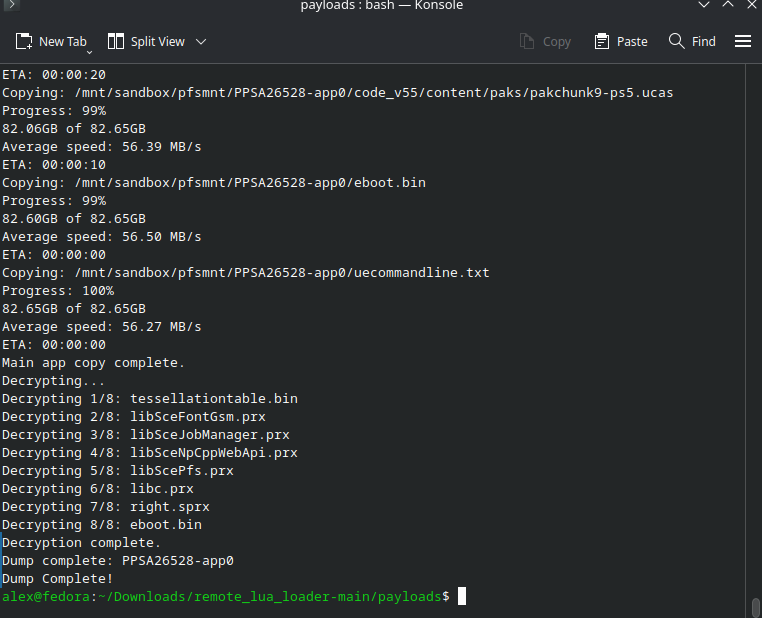
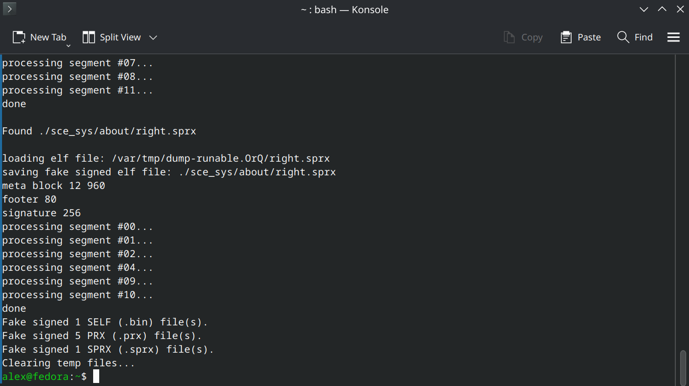

# How To Dump, Fakesign, & Run PS5 Game Backups

_By Alex Free_

This tutorial will cover how to dump, fake sign (allowing any console including your own to run the backup), and test (**without deleting anything before you know the game can even be ran as a dumped folder!**) PS5 games and apps up to the latest jailbreakble FW 12.70. It works for any apps or games downloaded from PSN back when you were on the latest firmware that you've been hoarding all this time, as well as physical game discs. Doing this for a game installed from a physical game disc allows you to not have to put in the physical disc to play it!

## Table Of Contents

* [Changelog](changelog.md).

* [Preparations](#preparations).

* [Dumping](#dumping).

* [Fake Signing](#fake-signing).

* [Dump Folder To FFPKG (UFS2) Image Conversion](#dump-folder-to-ffpkg-ufs2-image-conversion).

* [Notes](#notes).

## Preparations

* You need to jailbreak your PS5 console. If your on FW 12.70, you can follow [my tutorial](https://alex-free.github.io/ps5-jb-12.70fw-tutorial/).

* You need to download [PS5 Make FSELF Recursive](https://github.com/alex-free/ps5-make-fself-recursive) to fakesign the decrypted dump to be played on a jailbroken PS5.

* You need to download the latest version of [PS5 App Dumper](https://github.com/EchoStretch/ps5-app-dumper/releases).

* You need a USB device formatted as ExFat, with enough free storage to dump the game. I seriously recommend using a USB HDD (really, you'll see why in the testing phase) or USB SSD for faster speeds. Ideally these have read access lights that blink too. A USB flash drive is a horrible idea because these won't have access lights and the dump speed will be horrible and take forever.

* You need a PC connected to the same network as the PS5.

* Download and install any updates to the game if you want those included in the dump. A Jailbroken PS5 can still install download updates from Sony servers if you haven't blocked them.

* If your dumping a disc game, wait until its completely installed to the PS5 storage.

## Dumping

Fist of all, if you are OK with connecting your PS5 to Sony servers and want to bundle in the updates of the game, make sure all game updates that are available for your current FW are installed. These are going to be included in your dump.

Next, make sure the USB device is plugged into the console, and then fire up that game. Once it's running, you need to send the PS5 App Dumper payload via netcat. The command is:

`nc < <IP address> 9021 < <path to ps5-app-dumper.elf>`

So in my case it was: 

`nc 10.0.0.174 9021 < /home/alex/Downloads/ps5-app-dumper.elf`

A notification will appear saying the dumping is starting. You'll get progress in the form of constant PS5 notifications as well as on your PC terminal.



## Fake Signing

You have 2 different options here, you can fake sign on console with Dump Runner, or you can fake sign on computer with [PS5 Make FSELF Recursive](https://github.com/alex-free/ps5-make-fself-recursive).

### Fake Sign On Console With Dump Runner

 By running the game once with dump runner it will automatically fake sign everything in the dump, and move anything the original decrypted binaries/libraries to a folder called `decrypted' inside the game dump folder.

### Fake Sign On Computer With Make Fself Recursive 

Remove the USB device from your PS5. Connect the USB device to your computer, and you'll see in the root of it there will now be a folder named `homebrew`. Inside will be another folder, named after the title ID of the PS5 game/app just dumped, appended with `-app0`. Copy this to somewhere safe.

If you want to copy a virigin copy of the 'decrypted' backup for pedantic reasons, make a copy of the decrypted folder somewhere because the next part is going to fake sign the game dump folder. Give [PS5 Make FSELF Recursive](https://github.com/alex-free/ps5-make-fself-recursive) the decrypted game dump folder as argument, for example `ps5mfr PPSA02530-app0`. This will look through the game dump (which is already decrytped, PS5 App Dumper automatically decrypts as it dumps since [v1.01 Beta](https://github.com/EchoStretch/ps5-app-dumper/releases/tag/v1.01)), and fake sign the `eboot.bin` as well as any `*.psx` shared libraries that it finds.



Go back to your USB and delete the original decrypted game dump folder. Copy over your fake signed game dump folder to the root of the usb in the `homebrew` folder (or wherever you want to that ShadowMountPlus looks at).

## Testing

### Preperation

So the dump is ready to be used on any Jailbroken PS5 that meets the minimum firmware requirement. You can find out what that minimum firmware requirment is by going into the root of the game dump folder and opening the `sce_sys/param.json` that is generated by PS5 App Dumper. Look for the string `requiredSystemSoftwareVersion`.

You probably also want to know what version you just dumped. That is also in `sce_sys/param.json`, look for the string `contentVersion`. You should see something like `0x1270000000000000`.

Now we need to test this out. We don't want to go deleting the legit game (espically if it was downloaded from PSN and isn't available as a physical copy) because that will not allow you to dump it in the future with new game updates. We don't have to though.

Because App Dumper helpfully appends `-app0` to the dump folder name, it will override the legit game installation already. If your fake signed game dump folder was named the ligit naming without `-app0` (i.e. `PPSA02530`) then the legit game installation would actually override the dump. As long as the fake signed game dump folder is named anything besides the legit naming it will override.

### Moving To Target Storage If Applicable

Lastly, if you want to put the game anywhere special, now is the time to do it. It's fine in the `homebrew` folder if you want to leave it there though.

```
Default scan locations:

/data/homebrew
/data/etaHEN/games
/mnt/ext0/homebrew
/mnt/ext0/etaHEN/games
/mnt/ext1/homebrew
/mnt/ext1/etaHEN/games
/mnt/usb0/homebrew .. /mnt/usb7/homebrew
/mnt/usb0/etaHEN/games .. /mnt/usb7/etaHEN/games
/mnt/usb0 .. /mnt/usb7
/mnt/ext0
/mnt/ext1
```
**Note** for any game you put into internal, you have to make sure the `/data` folder has recursive RWX permissions (777). The best way to set this currently seems to be [FileZilla FTP client](https://filezilla-project.org/), which is available for Windows, Mac, and Linux.

### Mounting The Dump Folder

Send ShadowMountPlus over to the console. If it's already running, send it again just to make sure everything looks right, and that 777 permissions are applied if running from internal PS5 storage. The command will be:

`nc <IP address> 9021 < <path to shadow mount plus elf file>`

So in my case it was:

`nc 10.0.0.174 9021 < /home/alex/Downloads/ShadowMountPlus_1.6test11/shadowmountplus.elf`

Wait for it to find your game dump. **This will override the legit game installation in the PS5 home menu, so when you launch the game it will use the ShadowMountPlus mounted decrypted and fakesigned game dump folder instead of the internal installation.** This is exactly what we want, because I don't know about you but I currently don't have multiple PS5s (let alone jailbreakable ones).

This is what I alluded to about in the begining about using a USB HDD. One way you can tell the dump is actually overriding the internal game is it will load up much slower. Better however is if you have access lights on your USB HDD or USB SSD. A final, nuclear option to prove this is working is you can copy your decrypted dump that isn't fakesigned over, and when you try to lauch the game you will get an error as it is not fakesigned, further proving this works. Also, just look at the output of ShadowMountPlus if your netcatting it over already to make sure it's mounting...

## Dump Folder To FFPKG (UFS2) Image Conversion

This is the recommended 'native' format ShadowMountPlus uses.

UFS is a *BSD filesystem, so we need BSD tools to make them. If your on *BSD, you already have them and can use [mkufs2.sh](https://github.com/drakmor/ShadowMountPlus/raw/refs/heads/main/mkufs2.sh) from the [ShadowMountPlus](https://github.com/drakmor/ShadowMountPlus) github. The usage is:

```mkufs2.sh <game dump folder named as title id> ./<title id>.ffpkg```

So in my example with Pragmata:

```mkufs2.sh PPSA02530  PPSA02530 .ffpkg```

For Mac, Windows, and Linux, the best thing to use is [UFS2Tool](https://github.com/SvenGDK/UFS2Tool/releases). For Linux, I used the [linux-x64-selfcontained.zip
](https://github.com/SvenGDK/UFS2Tool/releases). Then, the command will be:

```UFS2Tool newfs -O 2 -b 65536 -f 65536 -m 0 -S 4096 -i 262144 -D ./<game dump folder named as title id> <title id>.ffpkg```

So in my example with Pragmata:

```/home/alex/Downloads/linux-x64-selfcontained/UFS2Tool newfs -O 2 -b 65536 -f 65536 -m 0 -S 4096 -i 262144 -D ./PPSA02530 PPSA02530.ffpkg```

To use it with ShadowMountPlus, same thing, put the `.ffpkg` anywhere you'd normally put a game dump folder at and enjoy.

## Notes

* If you find that no ShadowMountPlus mounted games are launching and causing an immediete KP, even though they did previously (this can happen if you move the game from say an external USB to an internal USB it can get confused), delete `/data/shadowmountplus` and `/user/data/shadowmountplus` to reset all configs. Note that if ShadowMountPlus is running while you do this, you will get an error as not all files will be alowed to be deleted but thats ok. You can avoid the error by doing the BEFORE you send over ShadowMountPlus.

* Some games may run better either as a folder or as a .ffpkg.

* Some games may not run from internal.

* Some games may run better from USB.

* Some games may require a fast storage to work properly (i.e. CyberPunk 2077, HDD is not enough).

* Backports are a thing that PS5 App Dumper is capable of. This can allow the dump to run on much earlier PS5 FW versions if everything works out. Because I don't have any other PS5 but the latest jailbreakable FW 12.70, I have no way to test this or give advice on it currently.

* I imagine DLC is also included in the dumps, but I'll need to look into it as I dump more games.
