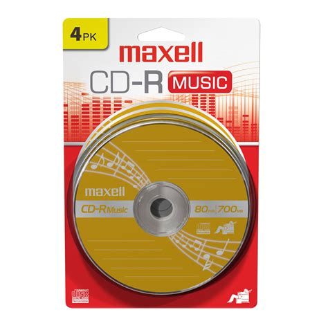
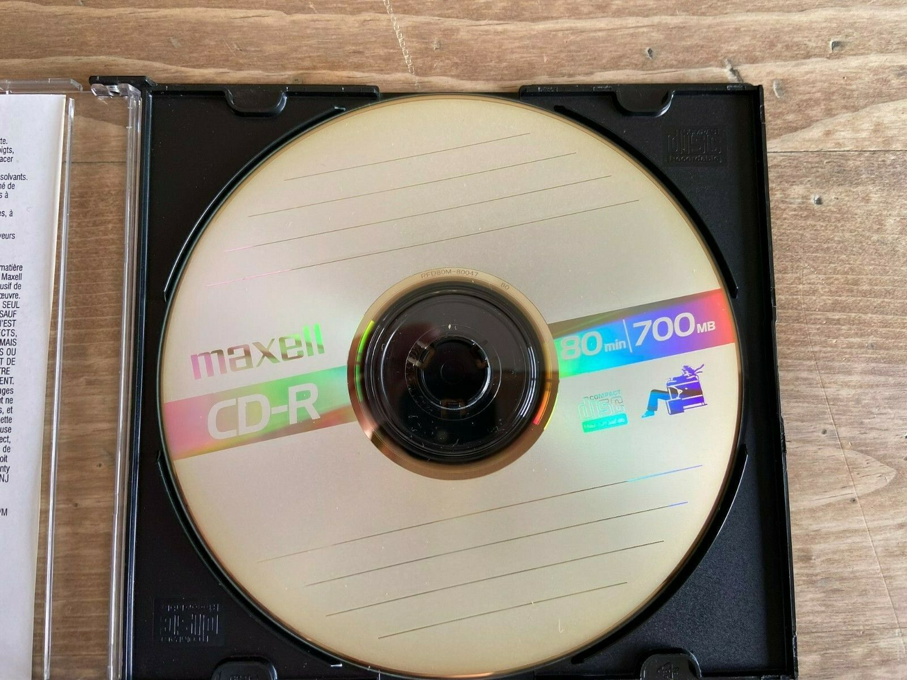
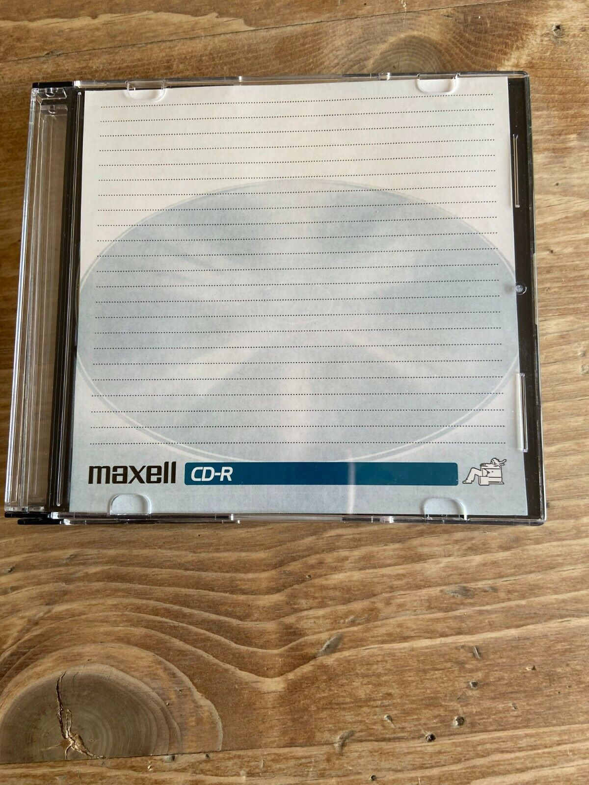

# [The Ultimate Guide To PSX CD-Rs](readme.md) -> [CD-R Media](readme.md#cd-r-media)

## Maxell CD-R 80 Minute

The 'music' branding is [just a tax](https://en.wikipedia.org/wiki/Private_copying_levy) (that just make these more expensive), all pictures are the same horrible quality media: 

Output of [cdrecord](https://cdrtools.sourceforge.net/private/cdrecord.html) `-atip`:

    ATIP info from disk:
      Indicated writing power: 4
    Disk Is unrestricted
    Disk Is not erasable
      Disk sub type: Medium Type A, low Beta category (A-) (2)
      ATIP start of lead in:  -12508 (97:15/17)
      ATIP start of lead out: 359845 (79:59/70)
    Disk type:    Short strategy type (Phthalocyanine or similar)
    Manuf. index: 22
    Manufacturer: Ritek Co.
