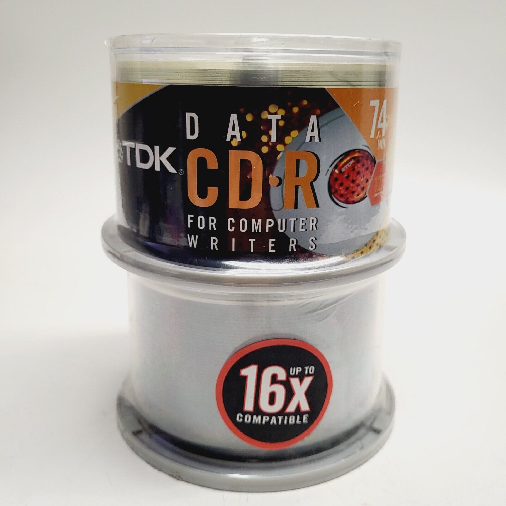

# [The Ultimate Guide To PSX CD-Rs](readme.md) -> [CD-R Media](readme.md#cd-r-media)

## TDK Data CD-R For Computer Writers (74 Minutes)

These work great, and are pretty cheap for 74 minute media if you can find them on eBay. The downside is the [infamous Ritek manufacturing process quality](https://cdmediaworld.com/hardware/cdrom/cd_tdk_iq.shtml), which does indeed result in many [disc-rotted coasters](https://cdmediaworld.com/hardware/cdrom/cd_quality.shtml#CD-R%20Quality%20Results) by now (confirmed by myself).

Output of [cdrecord](https://cdrtools.sourceforge.net/private/cdrecord.html) `-atip`:

    ATIP info from disk:
      Indicated writing power: 5
      Is not unrestricted
      Is not erasable
      Disk sub type: Medium Type A, high Beta category (A+) (3)
      ATIP start of lead in:  -11324 (97:31/01)
      ATIP start of lead out: 336225 (74:45/00)
    Disk type:    Long strategy type (Cyanine, AZO or similar)
    Manuf. index: 22
    Manufacturer: Ritek Co.

