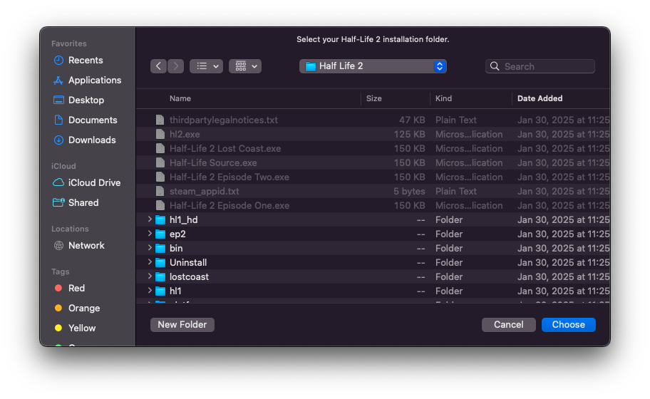
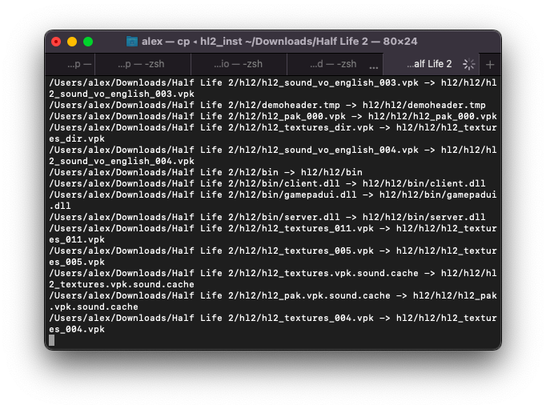
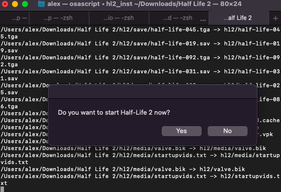
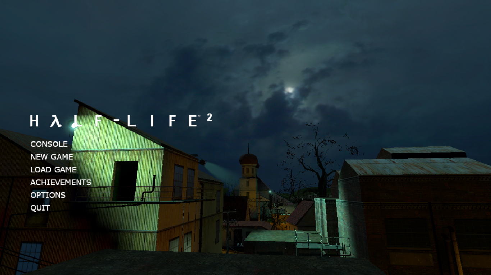

# Source Engine Mac App

_By Alex Free_

Play Half-Life 2 natively on Mac OS (including Mac OS 10.15 and up!). This project's goal is to package my fork of the [source-engine](https://github.com/alex-free/source-engine) in a portable (made possible by my [Portable Mac Directory](https://github.com/alex-free/portable-mac-directory) tool), pre-compiled, user friendly way to make this as easy as possible to accomplish.

This is important because Valve only supported up to Mac OS 10.14 in their official Half-Life 2 builds to this day.

I'm having a lot of fun with this using an Xbox One controller btw.

| [Homepage](https://alex-free.github.io/source-engine-mac-app) | [Github](https://github.com/alex-free/source-engine-mac-app) |

## Table Of Contents

* [Downloads](#downloads)
* [Requirements](#requirements)
* [Usage](#usage)
* [Notes](#notes)
* [Credits](#credits)
* [License](#license)
* [Building](build.md)

## Downloads

### Version 1.0 (2/4/2025)

* [source-engine-mac-app-v1.0.zip](https://github.com/alex-free/source-engine-mac-app/releases/download/v1.0/source-engine-mac-app-v1.0.zip) _For Mac OS 12 and newer, x86_64_

## Requirements

* If your using the release above, you need Mac OS 12. Literally the lowest spec Mac that can run Mac OS 12 plays this great. To run this on Mac OS 11 and earlier, or natively on ARM, you can [build it from source](build.md). You might be able to use the above Intel build on ARM Macs (via the built in Rosetta 2 tech) but this is not tested because I do not own one.

* A Half-Life 2 installation. You can get this by installing Half-Life 2 on Linux or Windows. The Half-Life 2 installation **can not be the latest 20th anniversary edition**. If your using steam you can get the older version of the game before the 20th anniversary edition came out by following the instructions below (info from [here](https://www.youtube.com/watch?v=mMuSXs0SF_g)):

1) Open Steam.

2) Click Half-Life 2.

3) Click on manage (gear icon on the right).

4) Click Properties.

5) Click Betas.

6) In beta participation, click "steam_legacy - pre-20th anniversary build".
7) Go back and download the game again.

## Usage

1) Download and extract the latest release above.

2) Double click `Source Engine.app`.

3) When the folder select window appears, select your Half-Life 2 installation folder.

4) A tab or new window of Terminal.app will appear, showing the installation of Half-Life 2 into Source Engine.app. 

5) After the installation into `Source Engine.app` completes, a new window will appear asking if you want to start Half-Life 2 now.

6) At any point now, you can double click `Source Engine.app` and it will start Half-Life 2!

## Notes

Modern Mac OS versions employ various security measures against unsigned applications (which this is, because even if I did want to sign it Apple would never approve it). If you have trouble starting `Source Engine.app`, refer to the following:

### Problem: `Source Engine.app` becomes unresponsive and takes an extremely long time to start up the first time.

This is some kind of Mac OS scanning security measure. It can take an extremely long time (minutes). It starts up immediately when you open it in the future. The only thing that can make it take a long time again is if you move the location of `Source Engine.app` (which is portable and can be anywhere).

### Problem: A window appears with "Source Engine.app can't be opened because it is from an unidentified developer."

On [Mac OS 14](https://support.apple.com/guide/mac-help/open-a-mac-app-from-an-unidentified-developer-mh40616/14.0/mac/14.0) and below you can click `Ok` to close the window and then press and hold the control key while clicking `Source Engine.app` once. This adds a security exemption to allow `Source Engine.app` to start. 

On Mac OS 15 and up you need to allow the exemption manually in System Preferences as the control-click functionality was removed. Follow the instructions below (info [from Apple](https://support.apple.com/guide/mac-help/open-a-mac-app-from-an-unknown-developer-mh40616/15.0/mac/15.0)):

1) On your Mac, choose Apple menu  > System Settings, then click Privacy & Security  in the sidebar. (You may need to scroll down.)

2) Go to Security, then click Open.

3) Click Open Anyway. This button is available for about an hour after you try to open the app.

4) Enter your login password, then click OK.

### Problem: A window appears with "Source Engine.app is damaged and can't be opened. You should move it to the Trash".

Execute the following command in `Terminal.app`:

`xattr -d com.apple.quarantine "/path/to/Source Engine.app"`

Replace `"/path/to/Source Engine.app"` with the actual location of Source Engine.app, which can be anywhere since it's portable. Just drag it into the terminal after typing `xattr -d com.apple.quarantine ` and press enter.

### Problem: Permissions are not allowed for "Source Engine.app" to function. When you first run `Source Engine.app`, it will ask for some permissions to be able to function. If you have some permissions related to Terminal.app set in a certain way or if you decline the prompts that Source Engine.app gives you by accident you may need to reset them.

Execute the following command in `Terminal.app`:

`tccutil reset Accessibility com.apple.ScriptEditor.id.Source-Engine`

If this doesn't work, you can globally reset it (which will prompt all Applications for permissions, you might need this if Terminal.app permissions are causing issues):

`tccutil reset Accessibility`

I have been told that you need to reboot after either of the above `tccutil reset` commands but this may not actually be required.

## Credits

* [Nilleruser](https://github.com/nillerusr) for his awesome [source-engine repo](https://github.com/nillerusr/source-engine).

* Jxhug for the awesome [Guide to Installing Half Life 2 Using Source Engine on macOS](https://jxhug.notion.site/Guide-to-Installing-Half-Life-2-Using-Source-Engine-on-macOS-9fa5ffc910f5454ab0f0e5da2a9e5b9f) which inspired this all.

* App icon is by [Lopagof](https://www.icons101.com/icon/id_75879/setid_2537/The_Orange_Box_by_Lopagof/Half_Life_2).

## License

The Application front-end itself is released by myself under the 3-BSD license, see [license.md](license.md). The Source Engine is Valve code and I do not assert any copyright. The App Icon is under the creative commons: NonCommercial-No Derivatives license.